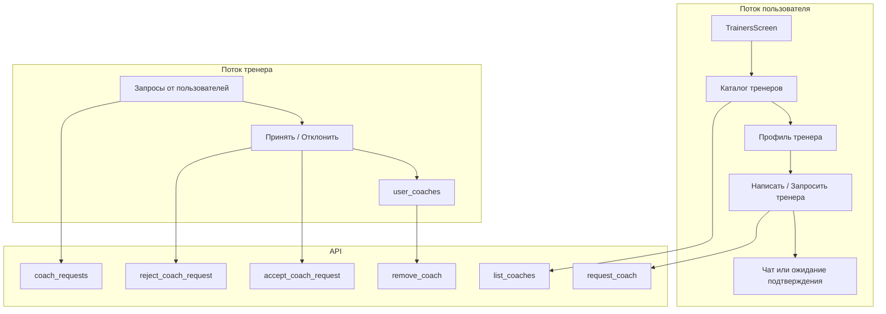

# Проектирование раздела «Тренеры»

## Текущее состояние

- **TrainersScreen** — заглушка (`src/screens/TrainersScreen.jsx`)
- **БД:** таблица `user_coaches` (user_id, coach_id, can_edit, can_view)
- **Роли:** `users.role` = admin | coach | user
- **Режимы:** `training_mode` = ai | coach | both | self
- **Профиль:** coaches отображаются в `UserProfileScreen` (блок «Тренер» / «С кем занимается»)
- **Чат:** прямые сообщения через `chat_get_direct_messages` / `chat_send_message_to_user` — уже работают для общения с тренером
- **Нет:** API списка тренеров, API запроса/принятия/отключения тренера
- **Роутинг:** `App.jsx` — `path="trainers"` (без `/*`, не матчит `/trainers/apply`), `AppTabsContent` — все вкладки mounted с `pathname.startsWith`

---

## Бенчмарк: как делают конкуренты

### TrainingPeaks

- **Coach Match:** анкета целей → персональный подбор тренера → бесплатная консультация до оплаты
- **Coach Search:** каталог с фильтрами: локация, вид спорта, услуги, языки, уровень спортсмена, пол тренера
- **Сертификация:** тренеры сертифицированы NGB и TrainingPeaks University
- **Sharing:** тренер делится планом с атлетом; при отсутствии связи — email-приглашение
- **Notes:** заметки к неделям/дням для коммуникации. PlanRun: чат уже есть — Notes можно добавить позже

### Athlete Connect, CoachList, Trainerize.me

- **Профиль атлета:** цели, уровень, доступность — для матчинга
- **Профиль тренера:** специализация, опыт, доступность, цены
- **Бронирование:** интеграция календаря и оплаты
- **Маркетплейс:** поиск по специализации, локации, онлайн/офлайн

### Team RunRun, V.O2 (бег)

- **Фильтры:** бюджет ($45–225/мес), специализация (марафон, ультра, травмы, питание, ментальные навыки), уровень (новичок → элита)
- **Карточка тренера:** имя, специализация, цена, сертификации, опыт

### CoachNow, Good Coach App

- **Приглашение:** тренер отправляет ссылку/email → атлет создаёт аккаунт → принимает приглашение
- **Онбординг:** анкета (роль, вид спорта, имя) перед подключением
- **Уведомления:** pending-приглашения в дашборде атлета

### Паттерны карточки тренера

- Фото (квадрат в списке, крупнее на странице)
- Краткое описание (в списке) и полное (на странице)
- Специализации (теги)
- Персональная ссылка
- Языки
- Статус «принимает новых учеников» / «занят»
- Рейтинг и отзывы (если есть)
- Время ответа («отвечает в течение 8 часов»)

### Выводы из бенчмарка

1. **Каталог + фильтры** — стандарт
2. **Профиль тренера:** специализация, описание, статус «принимает учеников»
3. **Коммуникация:** чат + опционально заметки к плану/неделе
4. **Монетизация:** PlanRun — оплата планируется в будущем

### Стоимость услуг тренера (подготовка к оплате)

**Отображение:** цены выводятся в каталоге и на профиле тренера. Оплата — в будущем; пока только информирование.

**Модель цен:** тренер задаёт несколько типов услуг на своё усмотрение. Рекомендуемые категории:

| Тип услуги | Описание | Пример |
|------------|----------|--------|
| **Индивидуальные тренировки** | Персональный план, еженедельная корректировка | 5000 ₽/мес |
| **Групповые тренировки** | Группа атлетов, общий план | 2000 ₽/мес |
| **Разовая консультация** | Разбор техники, анализ плана | 3000 ₽ |
| **Дополнительно** | Тренер добавляет свои пункты (например: «Анализ бега», «Составление плана на марафон») | — |

**Таблица `coach_pricing`:**

```
coach_pricing (id, coach_id, type, label, price, currency, period, sort_order)
type: individual | group | consultation | custom
label: VARCHAR — название услуги (для type=custom тренер вводит сам)
price: DECIMAL(10,2)
currency: VARCHAR(3) — RUB, USD и т.п.
period: month | week | one_time | custom — период (месяц, неделя, разово)
sort_order: INT — порядок отображения
```

**При регистрации (анкета «Стать тренером»):** отдельный шаг или блок в Шаге 4 — тренер добавляет 1–N позиций. Минимум: можно указать «Цены по запросу» (флаг `prices_on_request`) без конкретных сумм. Либо заполнить типовые (индивидуально, группово, консультация) + свои пункты.

**API:** `list_coaches`, `get_user_by_slug` возвращают `pricing: [{ type, label, price, currency, period }]` или `prices_on_request: true`.

**user_coaches / coach_requests:** при включении оплаты — `subscription_status`, `paid_until`. Пока не блокировать функционал.

---

## Архитектура решения



---

## 1. Модель данных

### Таблица coach_requests

```sql
CREATE TABLE coach_requests (
  id INT AUTO_INCREMENT PRIMARY KEY,
  user_id INT NOT NULL,            -- атлет
  coach_id INT NOT NULL,           -- тренер
  status ENUM('pending','accepted','rejected') DEFAULT 'pending',
  message TEXT NULL,               -- сопроводительное сообщение от атлета
  created_at TIMESTAMP DEFAULT CURRENT_TIMESTAMP,
  responded_at TIMESTAMP NULL,
  KEY idx_coach_status (coach_id, status),
  KEY idx_user_coach (user_id, coach_id)
);
```

- При `accepted` → INSERT в `user_coaches` (can_view=1, can_edit=1), создать in-app уведомление атлету
- При `rejected` → обновление status, in-app уведомление атлету

### Таблица coach_applications

```sql
CREATE TABLE coach_applications (
  id INT AUTO_INCREMENT PRIMARY KEY,
  user_id INT NOT NULL,
  status ENUM('pending','approved','rejected') DEFAULT 'pending',
  coach_specialization JSON,                   -- ["marathon","5k_10k","beginner"]
  coach_bio TEXT,                               -- 100-500 символов
  coach_philosophy VARCHAR(500) NULL,
  coach_experience_years TINYINT UNSIGNED NULL,
  coach_runner_achievements TEXT NULL,
  coach_athlete_achievements TEXT NULL,
  coach_certifications TEXT NULL,
  coach_contacts_extra VARCHAR(255) NULL,
  coach_accepts_new TINYINT(1) DEFAULT 1,
  coach_prices_on_request TINYINT(1) DEFAULT 0,
  coach_pricing_json JSON NULL,                -- [{type, label, price, currency, period}]
  created_at TIMESTAMP DEFAULT CURRENT_TIMESTAMP,
  reviewed_at TIMESTAMP NULL,
  reviewed_by INT NULL,
  KEY idx_status (status),
  KEY idx_user (user_id)
);
```

### Таблица coach_pricing

```sql
CREATE TABLE coach_pricing (
  id INT AUTO_INCREMENT PRIMARY KEY,
  coach_id INT NOT NULL,
  type ENUM('individual','group','consultation','custom') NOT NULL,
  label VARCHAR(255) NOT NULL,          -- название услуги
  price DECIMAL(10,2) NULL,
  currency VARCHAR(3) DEFAULT 'RUB',
  period ENUM('month','week','one_time','custom') DEFAULT 'month',
  sort_order INT DEFAULT 0,
  KEY idx_coach (coach_id)
);
```

### ALTER TABLE users — новые поля для тренера

```sql
ALTER TABLE users
  ADD COLUMN coach_bio TEXT NULL,
  ADD COLUMN coach_specialization JSON NULL,
  ADD COLUMN coach_accepts TINYINT(1) DEFAULT 0,
  ADD COLUMN coach_prices_on_request TINYINT(1) DEFAULT 0,
  ADD COLUMN coach_experience_years TINYINT UNSIGNED NULL,
  ADD COLUMN coach_philosophy VARCHAR(500) NULL;
```

---

## 2. API (бэкенд)

| Action                     | Метод | Описание                                                   | Кто вызывает                      |
| -------------------------- | ----- | ---------------------------------------------------------- | --------------------------------- |
| `list_coaches`             | GET   | Список тренеров (role=coach) с avatar, username, bio, slug, pricing. **Пагинация:** offset, limit (по 20), total. **Фильтры:** specialization, accepts_new. **Сортировка:** по last_activity | TrainersScreen                    |
| `get_user_by_slug`         | GET   | Уже есть — профиль тренера по slug                         | `/:username` (профиль тренера)    |
| `request_coach`            | POST  | Запрос на тренировку. Параметры: `coach_id`, `message` (TEXT, опционально — сопроводительное сообщение) | Пользователь                      |
| `coach_requests`          | GET   | Запросы для тренера (pending). **Пагинация:** offset, limit. Возвращает `message` от атлета | Тренер (вкладка «Запросы» в TrainersScreen) |
| `accept_coach_request`     | POST  | Принять запрос                                             | Тренер                            |
| `reject_coach_request`     | POST  | Отклонить запрос                                           | Тренер                            |
| `get_my_coaches`           | GET   | Список тренеров текущего пользователя (из user_coaches)    | SettingsScreen (блок «Мои тренеры») |
| `remove_coach`             | POST  | Отвязать тренера. Может вызываться и атлетом (отвязать тренера), и тренером (отказаться от атлета). Проверка: `user_id = currentUser OR coach_id = currentUser` | Пользователь или тренер           |
| `apply_coach`              | POST  | Заявка «Стать тренером» (bio, specialization, pricing)     | Пользователь                      |
| `admin_coach_applications` | GET   | Список заявок на роль тренера                              | AdminScreen                       |
| `admin_approve_coach`      | POST  | Одобрить заявку → role=coach                               | Админ                             |
| `admin_reject_coach`       | POST  | Отклонить заявку                                           | Админ                             |
| `get_coach_pricing`        | GET   | Цены тренера (для текущего coach)                          | SettingsScreen (блок «Стоимость») |
| `update_coach_pricing`     | POST  | Обновить цены тренера                                      | Тренер (SettingsScreen)           |
| `coach_athletes`          | GET   | Список атлетов тренера (id, username, slug, avatar, last_activity) | TrainersScreen (Мои ученики), CalendarScreen (dropdown) |

---

## 2a. Архитектура бэкенда

Все API-эндпоинты в проекте группируются по контроллерам (`planrun-backend/controllers/`). Для раздела «Тренеры» — создать **`CoachController.php`** (по аналогии с `AdminController`, `ChatController`).

### CoachController.php — методы

| Метод | Описание |
|-------|----------|
| `listCoaches()` | GET — каталог тренеров с пагинацией, фильтрами, join `coach_pricing` |
| `requestCoach()` | POST — запрос на тренировку (проверки: не себя, не дубликат, тренер принимает) |
| `getCoachRequests()` | GET — pending-запросы для текущего тренера, с пагинацией |
| `acceptCoachRequest()` | POST — принять запрос → INSERT `user_coaches`, notification атлету |
| `rejectCoachRequest()` | POST — отклонить запрос, notification атлету |
| `getMyCoaches()` | GET — тренеры текущего пользователя (из `user_coaches`) |
| `removeCoach()` | POST — отвязать тренера (проверка: вызывающий — атлет ИЛИ тренер) |
| `applyCoach()` | POST — заявка «Стать тренером» (проверки: нет pending, role≠coach) |
| `getCoachAthletes()` | GET — список атлетов тренера (id, username, slug, avatar, last_activity) |
| `getCoachPricing()` | GET — цены текущего тренера |
| `updateCoachPricing()` | POST — обновить/добавить цены |

### AdminController.php — расширение (заявки тренеров)

| Метод | Описание |
|-------|----------|
| `getCoachApplications()` | GET — список заявок с пагинацией |
| `approveCoachApplication()` | POST — одобрить → role=coach, копировать поля в `users` + `coach_pricing`, notification |
| `rejectCoachApplication()` | POST — отклонить, notification пользователю |

### Роутинг в api_v2.php

Добавить ~15 case в switch-роутер: `list_coaches`, `request_coach`, `coach_requests`, `accept_coach_request`, `reject_coach_request`, `get_my_coaches`, `remove_coach`, `apply_coach`, `coach_athletes`, `get_coach_pricing`, `update_coach_pricing`, `admin_coach_applications`, `admin_approve_coach`, `admin_reject_coach`.

---

## 2b. Безопасность и проверки

| Проверка | Описание |
|----------|----------|
| **Self-request** | Нельзя запросить себя как тренера (`user_id ≠ coach_id`) |
| **Дубликаты запросов** | Нельзя отправить повторный pending-запрос тому же тренеру (UNIQUE `user_id + coach_id` при `status=pending`) |
| **Rate limiting** | `request_coach` и `apply_coach` — лимит 5/час (через `RateLimiter`) |
| **Роли: admin >= coach** | Админ автоматически имеет все привилегии тренера без смены `role`. При проверке `isCoachOrAdmin`: `role IN ('coach', 'admin')` |
| **remove_coach** | Может вызываться и атлетом (отвязать тренера), и тренером (отказаться от атлета). Проверка: `user_id = currentUser OR coach_id = currentUser` |
| **apply_coach** | Нельзя подать, если уже `role=coach` или есть pending-заявка |
| **coach_requests авторизация** | `accept/reject` — только тренер, указанный в `coach_id` запроса |

---

## 3. Профиль тренера

**Расширение `users`:**

- `coach_bio` (TEXT) — краткое описание
- `coach_specialization` (VARCHAR/JSON) — «марафон», «5 км», «начинающие» и т.п.
- `coach_accepts` (TINYINT) — принимает ли новых учеников
- `coach_prices_on_request` (TINYINT) — цены по запросу (без конкретных сумм)

**Профиль тренера:** переиспользовать `UserProfileScreen` с `/:username` — для `role=coach` показывать блок «Тренер» с описанием, **стоимостью услуг** (список позиций или «По запросу») и кнопкой «Написать» / «Запросить тренера».

**Расширение `get_user_by_slug`:** Текущий API не возвращает `role` и coach-поля. Необходимо:
- Добавить в SELECT: `role, coach_bio, coach_specialization, coach_accepts, coach_prices_on_request, coach_experience_years, coach_philosophy`
- Для `role IN ('coach', 'admin')` — подгружать массив `pricing` из `coach_pricing`
- Возвращать в `data.user`: `role`, coach-поля и `pricing: [{ type, label, price, currency, period }]` (или `prices_on_request: true`)

---

## 3a. UI/UX: продуманный и удобный интерфейс

Весь функционал тренеров требует **продуманного и удобного интерфейса**. Ниже — принципы и конкретные решения.

### Принципы

- **Минимум кликов** — частые действия (открыть календарь атлета, добавить тренировку) доступны за 1–2 клика
- **Контекст всегда ясен** — тренер всегда понимает: «я смотрю календарь Ивана» или «свой календарь»
- **Единый стиль** — токены из `sports-colors.css`, `.card`, `.btn`, иконки из `Icons.jsx` (modals.mdc, icons.mdc)
- **Мобилка и десктоп** — BottomNav + TopHeader; Liquid Glass на мобилках; breakpoint 1024px

### Ключевые экраны и потоки

| Экран / поток | Что важно для UX |
|---------------|------------------|
| **«Мои ученики»** | Карточки с аватаром, именем, мини-метриками. Крупная зона клика «Календарь». Сортировка по последней активности. Поиск по имени при >5 атлетов |
| **Календарь атлета** | Чёткий заголовок «Календарь: Иван Петров» или бейдж «Режим тренера». Кнопка «Назад к списку» / «Мои ученики». Без перепутывания со своим календарём |
| **DayModal (режим тренера)** | Кнопки «Добавить», «Скопировать на дату», «Написать» — на видных местах. Заметка к дню — компактное поле, не перегружает |
| **Заявка «Стать тренером»** | Многошаговая форма (5 шагов: специализация, опыт, о себе, сертификации, стоимость), прогресс-бар, подсказки |
| **Каталог тренеров** | Карточки с фильтрами. Фильтры — чекбоксы или chips, не скрыты в меню |

### Рекомендации перед реализацией

1. **Wireframes / макеты** — хотя бы схематичные экраны «Мои ученики», календарь атлета, DayModal в режиме тренера
2. **Прототип** — кликабельный прототип (Figma, или статичные HTML-страницы) для проверки потока
3. **Итерации** — Фаза 1 → обратная связь → доработка UI → Фаза 2
4. **Тестирование** — прогон с реальным тренером: «найди календарь атлета», «скопируй неделю»

### Где может «ломаться» UX

- Слишком много вкладок/подразделов в «Тренеры» (каталог vs мои ученики vs заявки)
- Неочевидный переход «профиль атлета → календарь»
- Модалки поверх модалок (DayModal → AddTrainingModal → ещё что-то)
- На мобилке: мелкие кнопки, переполненный DayModal

### Чек-лист UI для раздела тренеров

- [ ] «Мои ученики»: карточки читаемые, кнопка «Календарь» заметна
- [ ] Режим тренера в календаре: визуально отличим от своего
- [ ] DayModal: кнопки тренера не загромождают, приоритеты ясны
- [ ] Анкета: 5 шагов, прогресс, подсказки, блок стоимости
- [ ] Мобилка: touch targets ≥44px, Liquid Glass, без лишних уровней вложенности

---

## 3b. Доступ к разделу «Тренеры» (принято)

Раздел **закрыт** до готовности. Доступ только у тренеров и админов.

| Роль | Что видит |
|------|-----------|
| **user** (обычный пользователь) | Заглушка: «Раздел в разработке. Здесь будет каталог тренеров...» (как сейчас) |
| **coach** (тренер) | «Мои ученики» — список атлетов |
| **admin** (админ) | И каталог тренеров, и «Мои ученики» (оба подраздела) |

**Апрувы тренеров** (одобрение заявок «Стать тренером») — в разделе **Админка** (AdminScreen), не в «Тренеры». Вкладка «Заявки тренеров» в AdminScreen.

**Push админам:** при новой заявке «Стать тренером» админам приходит push-уведомление (например: «Новая заявка на роль тренера от Иван»).

**Реализация:** TrainersScreen проверяет `user.role`; при `user` рендерит заглушку; при `coach` — «Мои ученики»; при `admin` — табы «Тренеры» + «Мои ученики».

---

## 4. UI — TrainersScreen

### Структура (зависит от роли)

**Для пользователя (role=user):**
- Заглушка (как сейчас). Раздел закрыт, доступ только у тренеров и админов. В заглушке — кнопка «Хотите стать тренером? [Подать заявку]» → `/trainers/apply`.

**После открытия раздела для пользователей** (будущее):
1. Заголовок «Тренеры», каталог тренеров, фильтры
2. Пустое состояние: «Тренеры пока не добавлены»

**Для тренера (role=coach):**
1. **Заголовок:** «Мои ученики»
2. **Список атлетов:** карточки (аватар, имя, последняя активность, кнопка «Календарь»)
3. **Пустое состояние:** «У вас пока нет учеников»

**Для админа (role=admin):**
1. Оба подраздела: **«Тренеры»** (каталог) и **«Мои ученики»** (список атлетов — если админ также тренер; иначе пустое состояние «У вас нет учеников» или «Доступно тренерам»)
2. Табы или переключатель между ними. Если админ также тренер — третья вкладка **«Запросы»** (как у coach). «Все атлеты» (админский список всех пользователей) — в бэклог, не в MVP

### Стили

- Контейнер: `max-width: var(--page-max-width)`, `padding: var(--page-padding)`
- Карточки: `.card`, `.card--interactive`
- Иконки: `GraduationCapIcon` из `Icons.jsx`
- Кнопки: `.btn`, `.btn-primary`, `.btn-secondary`

### Фильтры

- **MVP:** «Специализация» (марафон, 5 км, начинающие, травмы)
- **Расширение:** уровень атлета, «принимает новых учеников», язык, бюджет (диапазон цен)

### Карточка тренера

| Элемент                         | MVP | Позже |
| ------------------------------- | --- | ----- |
| Аватар, имя                     | ✓   |       |
| Специализация (теги)            | ✓   |       |
| Краткое описание (1–2 строки)    | ✓   |       |
| Стоимость услуг                 | ✓   | «От 5000 ₽/мес» или «По запросу» |
| Кнопка «Подробнее» / «Написать» | ✓   |       |
| Статус «принимает учеников»     | —   | ✓     |
| Рейтинг / отзывы                | —   | ✓     |

---

## 5. Поток для тренера

**Где:** вкладка «Запросы» в TrainersScreen при role=coach (рядом с «Мои ученики»).

- Вкладка «Запросы» — список pending `coach_requests`
- Кнопки: «Принять», «Отклонить»
- При принятии: INSERT в `user_coaches`, пользователь получает уведомление (in-app или push — см. Фаза 4, задача 4.4)

---

## 6. Интеграция с существующим

- **UserProfileScreen:** для `role=coach` — блок «Тренер» с bio, стоимостью услуг и кнопкой «Запросить»
- **ChatScreen:** диалоги с тренерами через `chat?contact=username_slug`
- **Настройки:** блок «Мои тренеры» с возможностью отвязать. Для тренера (role=coach) — блок «Стоимость услуг» с редактированием позиций.

---

## 7. Модерация тренеров (принято)

**Поток:** Пользователь подаёт заявку «Стать тренером» → админ обрабатывает в AdminScreen → одобряет → role=coach.

**При одобрении:** копировать поля анкеты из `coach_applications` в `users` (coach_bio, coach_specialization, coach_accepts_new → coach_accepts). Копировать цены в `coach_pricing` (coach_id = user_id). Опционально для каталога: coach_experience_years, coach_philosophy — добавить в `users` при расширении карточки.

- **Таблица:** `coach_applications` (id, user_id, status, поля анкеты, created_at, reviewed_at, reviewed_by)
- **API:** `apply_coach`, `admin_coach_applications`, `admin_approve_coach`, `admin_reject_coach`
- **UI:** кнопка «Стать тренером» → анкета → отправка; AdminScreen — вкладка «Заявки тренеров»

---

## 7a. Кнопка «Стать тренером» на лендинге (принято)

**LandingScreen** (`src/screens/LandingScreen.jsx`): кнопка для регистрации тренера.

- **Размещение:** хедер или hero
- **Текст:** «Стать тренером»
- **Действие:** переход на `/trainers/apply`. Требуется авторизация — иначе редирект на логин/регистрацию.

**TrainersScreen** (заглушка для role=user): кнопка «Хотите стать тренером? [Подать заявку]» — для уже авторизованных пользователей, ведущая на `/trainers/apply`.

**Маршрут `/trainers/apply`:**

1. **`App.jsx`:** изменить `<Route path="trainers" element={null} />` → `<Route path="trainers/*" element={null} />` — иначе React Router не матчит вложенные пути
2. **`AppTabsContent.jsx`:** в блоке `/trainers` проверять `pathname === '/trainers/apply'` — если да, рендерить `ApplyCoachForm` вместо `TrainersScreen`
3. Требуется авторизация — неавторизованный пользователь редиректится на login

---

## 7b. Анкета заявки «Стать тренером»

Цель: **максимально понятная и информативная** форма.

### Бенчмарк

**TrainingPeaks, RunDoyen, Fitness Coach Certification:** многошаговая форма, логические блоки, прогрессивное раскрытие. 2–4 поля на шаг, прогресс-бар, подсказки, примеры в placeholder.

---

### Шаг 1: Специализация

| Поле              | Тип                     | Обязательно | Подсказка / placeholder                                                                                       |
| ----------------- | ----------------------- | ----------- | ------------------------------------------------------------------------------------------------------------- |
| **Специализация** | multi-select (чекбоксы) | ✓           | «Выберите, с кем вы работаете»                                                                                |
| Варианты          | —                       | —           | Марафон, 5/10 км, полумарафон, ультра, трейл, начинающие, травмы и восстановление, питание, ментальные навыки |

**Стандартизированные теги** (хранятся как JSON-массив в `coach_specialization`):

| Ключ | Отображение |
|------|-------------|
| `marathon` | Марафон |
| `half_marathon` | Полумарафон |
| `5k_10k` | 5/10 км |
| `ultra` | Ультра |
| `trail` | Трейл |
| `beginner` | Начинающие |
| `injury_recovery` | Травмы и восстановление |
| `nutrition` | Питание |
| `mental` | Ментальные навыки |

Фильтрация на бэкенде: `JSON_CONTAINS(coach_specialization, '"marathon"')`. Фронтенд: чекбоксы с этими вариантами.

**Подсказка под полем:** «Эти теги помогут спортсменам найти вас в каталоге. Можно выбрать несколько.»

---

### Шаг 2: Опыт и достижения

| Поле                          | Тип          | Обязательно | Подсказка / placeholder                              |
| ----------------------------- | ------------ | ----------- | ---------------------------------------------------- |
| **Опыт (лет)**                | number, 1–50 | ✓           | «Сколько лет вы тренируете бегунов»                  |
| **Свои достижения как бегун** | textarea     | —           | «Например: марафон 2:45, участие в Boston Marathon»  |
| **Достижения учеников**       | textarea     | —           | «Например: 10 учеников финишировали марафон, 2 — BQ» |

**Подсказка:** «Опишите кратко: это помогает спортсменам понять ваш уровень и стиль.»

---

### Шаг 3: О себе и подход

| Поле                     | Тип                        | Обязательно | Подсказка / placeholder                                             |
| ------------------------ | -------------------------- | ----------- | ------------------------------------------------------------------- |
| **О себе (bio)**         | textarea, 100–500 символов | ✓           | «Расскажите о себе: опыт, подход к тренировкам, с кем вы работаете» |
| **Тренерская философия** | textarea, до 200 символов  | —           | «Например: „Прогресс через постепенность и восстановление“»         |

**Подсказка:** «Этот текст будет виден в вашей карточке в каталоге. Пишите живым языком.»

---

### Шаг 4: Сертификации и контакты

| Поле                         | Тип      | Обязательно | Подсказка / placeholder                                     |
| ---------------------------- | -------- | ----------- | ----------------------------------------------------------- |
| **Сертификации**             | textarea | —           | «IAAF, NGB, курсы по бегу, First Aid, CPR и т.п.»           |
| **Доп. контакты**            | text     | —           | «Telegram, WhatsApp — если не совпадают с email из профиля» |
| **Принимают новых учеников** | checkbox | —           | По умолчанию да. «Снимите, если сейчас не берёте новых»    |

---

### Шаг 5: Стоимость услуг

| Поле | Тип | Обязательно | Описание |
|------|-----|-------------|----------|
| **Цены по запросу** | checkbox | — | Если отмечено — не показывать конкретные суммы, только «По запросу» |
| **Позиции цен** | repeatable | — | Тренер добавляет 1–N позиций. Каждая: тип (индивидуально / группово / консультация / своё), название (для «своё»), сумма, валюта (RUB), период (мес / нед / разово) |

**Типовые варианты (можно выбрать и заполнить):**
- Индивидуальные тренировки (персональный план) — ₽/мес
- Групповые тренировки — ₽/мес
- Разовая консультация — ₽

**Дополнительно:** кнопка «Добавить услугу» — тренер вводит своё название и цену (например: «Анализ бега» 2000 ₽, «План на марафон» 5000 ₽).

**Подсказка:** «Цены помогут спортсменам сориентироваться. Можно указать «По запросу» или добавить несколько позиций.»

---

### UX-приёмы

- **Многошаговость:** 5 шагов (специализация, опыт, о себе, сертификации, стоимость), прогресс-бар, кнопки «Назад» / «Далее»
- **Информативность:** заголовок шага и подзаголовок-пояснение
- **Подсказки:** иконка «?» или tooltip с примером
- **Валидация:** inline-ошибки, подсветка символов (bio: «осталось 400 символов»)
- **Автосохранение:** черновик в localStorage при уходе (опционально)

### Логика

- **Повторная заявка:** pending — не давать новую; rejected — «Подать повторно»
- **Уже тренер:** если role=coach — «Вы уже тренер»
- **Валидация:** bio 100–500 символов, минимум 1 специализация, опыт 1–50

### Таблица coach_applications

Поля: `coach_specialization` (JSON или comma-separated), `coach_bio`, `coach_philosophy`, `coach_experience_years`, `coach_runner_achievements`, `coach_athlete_achievements`, `coach_certifications`, `coach_accepts_new`, `coach_contacts_extra`, `coach_prices_on_request` (TINYINT). Цены — в отдельной таблице `coach_pricing` (связь через coach_id после одобрения) или JSON `coach_pricing_json` в заявке.

---

## 7c. Календарь для тренера: удобное планирование тренировок

Тренер должен быстро переключаться между атлетами и редактировать их планы. По бенчмарку TrainingPeaks: Athlete Library, переключение из календаря, Dual Calendar для сравнения.

### Текущее состояние

- **CalendarScreen** принимает `targetUserId`, `viewContext`, `canEdit`, `isOwner`, `canView` — но в `AppTabsContent` рендерится без них (всегда свой календарь)
- **UserProfileScreen** (`/:username`): при `access.is_coach` показывает календарь атлета, но `DayModal` с `canEdit={false}` — нужно передавать `access.can_edit`
- **API:** `get_day`, `save_result`, `get_plan` и др. поддерживают `view=user&slug=` (viewContext) — бэкенд проверяет coach через `getUserCoachAccess`
- **user_coaches.can_edit** — уже есть, тренер с can_edit может редактировать план

### Что нужно для удобной работы тренера

#### 1. Точки входа в календарь атлета

| Точка входа | Описание |
|-------------|----------|
| **Раздел «Мои ученики»** | Основная точка: список атлетов → клик / «Открыть календарь» → `/calendar?athlete=slug` |
| **Профиль атлета** `/:username` | Кнопка «Открыть календарь» → `/calendar?athlete=slug` |
| **URL напрямую** | `/calendar?athlete=username_slug` |

#### 2. Раздел «Мои ученики» (принято)

Отдельный раздел для тренера — список атлетов, с которыми он занимается.

**Название (на выбор):** «Мои ученики» | «Мои атлеты» | «Подопечные». Рекомендация: «Мои ученики» — привычно для тренерского контекста.

**Содержимое:**
- Список карточек атлетов (аватар, имя, последняя активность, прогресс)
- Клик по карточке → календарь атлета (`/calendar?athlete=slug`) или его профиль
- Кнопка «Календарь» / «Открыть календарь» на каждой карточке

**Где показывать:**
- **BottomNav** (мобилки) и **TopHeader** (десктоп) — раздел «Тренеры» уже есть в обоих
- При открытии `/trainers`: для `role=coach` — «Мои ученики» (список атлетов); для `role=user` — заглушка (каталог — после открытия раздела для пользователей)
- Один пункт навигации, контент зависит от роли

**API:** `coach_athletes` (GET) — список атлетов (id, username, username_slug, avatar_path, last_activity, week_progress).

#### 3. Визуальное отличие режима тренера

- Заголовок: «Календарь: Имя Атлета» или бейдж «Режим тренера»
- Цветовая индикация или иконка — чтобы не перепутать со своим календарью

#### 4. Редактирование (уже поддерживается)

- **AddTrainingModal** — добавление/редактирование тренировки (передавать `targetUserId` в API)
- **ResultModal** — запись результата за атлета (тренер вносит от его имени)
- **DayModal** — удаление тренировки, пометка «Выполнено»

Бэкенд: `save_result`, `add_training_day_by_date`, `update_training_day`, `delete_training_day` — должны принимать `user_id` целевого атлета при вызове от тренера (через viewContext или отдельный параметр).

#### 5. Ограничения и приватность

- Календарь атлета с `privacy_level=private` — только тренер и владелец (уже в `calendar_access.php`)
- Тренер видит только атлетов из `user_coaches`

### Этапы (дополнение к п.8)

- **7c.1** Исправить `UserProfileScreen`: передавать `canEdit={access.can_edit}` в DayModal для тренера
- **7c.2** Добавить кнопку «Открыть календарь» на профиле атлета (для тренера) → `/calendar?athlete=slug`
- **7c.3** CalendarScreen: читать `?athlete=slug`, загружать access (can_edit, can_view) и рендерить календарь атлета
- **7c.4** API `coach_athletes` — список атлетов тренера
- **7c.5** Раздел «Мои ученики» — список атлетов тренера (в TrainersScreen при role=coach или отдельная вкладка)
- **7c.6** (Позже) Dual Calendar — два календаря рядом для сравнения атлетов/планов

### Бенчмарк TrainingPeaks (календарь тренера)

- Athlete Library — клик по имени загружает календарь
- Drag-and-drop между календарями (Dual Calendar)
- Week Controls — копирование/вставка недель
- Recurring workouts — повторяющиеся тренировки на 90 дней
- Jump to Comment — быстрый комментарий к тренировке
- Keyboard shortcuts (C+drag = copy, E+click = edit)

Для MVP PlanRun: переключатель атлетов + полное редактирование календаря. Dual Calendar и recurring — позже.

---

## 7d. Предложения: удобная расстановка тренировок атлетам

Конкретные функции для ускорения планирования тренером.

### MVP (первая очередь)

| Функция | Описание | Сложность |
|---------|----------|-----------|
| **Быстрое добавление дня** | AddTrainingModal уже есть; тренер открывает день атлета → «Добавить тренировку». Убедиться, что targetUserId передаётся корректно | Низкая |
| **Копирование дня** | В DayModal: кнопка «Скопировать на дату» — выбрать другую дату, вставить тот же план дня | Средняя |
| **Копирование недели** | Week Controls: «Скопировать неделю» → выбрать целевую неделю/дату → вставить все дни разом | Средняя |

### Расширение (после MVP)

| Функция | Описание | Бенчмарк |
|---------|----------|----------|
| **Шаблоны недели** | Тренер сохраняет типовую неделю (например, «Базовая», «Интенсивная») и применяет к атлету одним кликом | TrainingPeaks, FITR Schedule Builder |
| **Повторяющиеся тренировки** | «Повторить на N недель» — одна тренировка копируется на те же дни недели (например, ОФП по вторникам на 8 недель) | TrainingPeaks Recurring (до 90 дней) |
| **Библиотека тренировок** | Личная библиотека тренера: «Лёгкий бег 8 км», «Интервалы 8×400» — перетаскивание на календарь | Sequence, TrueCoach |
| **Drag-and-drop** | Перетаскивание карточки тренировки на другой день | TrainingPeaks, TrueCoach |
| **Массовое копирование** | Выделение диапазона дат (Shift+клик) → Copy → Paste в другую неделю | TrainingPeaks Mass Copy/Paste |

### Приоритет для PlanRun

1. **Копирование дня** — часто один и тот же день (например, «ОФП») повторяется в разных неделях
2. **Копирование недели** — типичный блок «базовая неделя» копируется на несколько недель
3. **Шаблоны недели** — тренер создаёт 2–3 шаблона и быстро раскладывает план атлету
4. **Повторяющиеся тренировки** — для регулярных дней (ОФП, длительный бег) без ручного копирования

### API (для копирования)

- `copy_day` (POST): date_from, date_to, user_id — скопировать план дня на другую дату
- `copy_week` (POST): week_number_from, week_number_to (или date_from), user_id — скопировать неделю
- `get_week_templates` / `apply_week_template` — позже, для шаблонов

---

## 7e. Дополнительные идеи (backlog)

Функции, которые могут усилить раздел тренеров. **Привязка к фазам:** см. раздел 8 (Фазы 4–6).

### Коммуникация и обратная связь

| Идея | Описание | Бенчмарк |
|------|----------|----------|
| **Заметки к дню/неделе** | Тренер пишет заметку к конкретному дню или неделе («Фокус на темпе», «После этой недели — разгрузка»). Атлет видит в календаре | TrainingPeaks Notes |
| **Быстрый переход в чат** | В DayModal или карточке атлета — кнопка «Написать» → открывает чат с этим атлетом | Hevy, CoachLogik |
| **Комментарий к результату** | После того как атлет внёс результат — тренер может оставить короткий комментарий («Отлично!», «Темп чуть быстрее — ок») | TrainingPeaks Jump to Comment |

### Уведомления и алерты

| Идея | Описание |
|------|----------|
| **Атлету:** тренер принял запрос | In-app или push: «Тренер Иван принял ваш запрос» — при accept_coach_request |
| **Атлету:** тренер добавил/изменил тренировку | Push или in-app: «Тренер обновил ваш план на 15 марта» |
| **Тренеру:** атлет внёс результат | «Иван выполнил интервалы 12.03» — чтобы тренер мог оперативно отреагировать |
| **Тренеру:** атлет пропустил ключевую тренировку | Опционально: алерт при пропуске 2+ дней подряд или ключевого дня |
| **Еженедельный дайджест** | Тренеру на email: сводка по всем атлетам за неделю (выполнено X из Y, кто пропустил) |

### Обзор и аналитика

| Идея | Описание |
|------|----------|
| **Сводка по атлетам** | В «Мои ученики» — не только список, но и мини-метрики: «5/7 дней на этой неделе», «пропущено 2» |
| **Ключевые даты атлета** | Тренер видит цель (марафон 15.05), дату старта — при планировании календаря |
| **План vs факт** | Уже есть в статистике; для тренера — быстрый доступ из карточки атлета |

### Экспорт и интеграции

| Идея | Описание |
|------|----------|
| **Экспорт плана (PDF)** | Атлет или тренер скачивает план на месяц в PDF |
| **Экспорт в календарь** | iCal/Google Calendar — план как события |
| **Печать** | Версия календаря, удобная для печати |

### Аудит и прозрачность

| Идея | Описание |
|------|----------|
| **Кто изменил** | В истории: «Тренер добавил 15.03», «Атлет внёс результат 12.03», «AI пересчитал план» |
| **Уведомление об изменении** | Атлет видит, что тренер изменил план (если менял не он сам) |

### Группы и масштаб

| Идея | Описание |
|------|----------|
| **Группы атлетов** | Тренер создаёт группу «Марафонцы весна 2025» — одна и та же неделя применяется ко всем | TrainingPeaks |
| **Шаблон → группа** | Применить шаблон недели сразу к нескольким атлетам |

---

## 7f. Интерфейс тренера: перестройка навигации (coach-specific UX)

> Источник: `docs/coach-interface-future.md`, бенчмарк TrueCoach, CoachRx, TrainingPeaks.

### Проблема

Сейчас навигация одинакова для всех ролей. Тренер видит **свой** дашборд и календарь, а атлетов — только через вкладку «Тренеры» → «Мои ученики». Это неудобно: тренеру важны данные атлетов, а не свои.

### Решение: разная навигация для coach

**BottomNav для coach/admin:**

| Текущий (одинаковый для всех) | Предлагаемый (для coach) |
|-------------------------------|--------------------------|
| Дэшборд, Календарь, Статистика, Тренеры | **Атлеты**, Календарь, Статистика, **Запросы** |

**AppTabsContent — условный рендер по роли:**

| Вкладка | role=user | role=coach/admin |
|---------|-----------|------------------|
| `/` (home) | DashboardScreen | **AthletesOverviewScreen** — обзор всех атлетов |
| `/calendar` | CalendarScreen (свой) | CalendarScreen с **селектором атлета** наверху |
| `/stats` | StatsScreen (свой) | StatsScreen с **селектором атлета** и viewContext |
| `/trainers` | TrainersScreen (заглушка) | TrainersScreen (только **«Запросы»**) |

### AthletesOverviewScreen (новый экран)

**Назначение:** главная страница тренера — обзор всех атлетов с карточками.

**Содержимое карточки атлета:**
- Аватар, имя
- Последняя активность: «Был: 3 марта»
- Прогресс недели: «Неделя: 5/7» (выполнено/запланировано)
- Compliance (выполняемость): индикатор (зелёный >80%, жёлтый 50–80%, красный <50%)
- Быстрые действия: «Календарь» → `/calendar?athlete=slug`, «Профиль» → `/:slug`, «Написать» → `/chat?contact=slug`

**Блок «Требуют внимания» (Needs Attention):**
- Наверху — атлеты с проблемами: пропущено 2+ тренировки подряд, не заходил >7 дней, compliance <50%
- Остальные — в «Все атлеты»
- Паттерн: CoachRx, TrueCoach — выделение атлетов с низкой активностью

**Сортировка:**
- По имени, по последней активности (неактивные первые), по compliance
- Выпадающий селектор

**Пустое состояние:** «У вас пока нет учеников» + ссылка на «Запросы» если есть pending

### Селектор атлета (для Calendar/Stats)

При role=coach — наверху CalendarScreen и StatsScreen:
- Dropdown/chips с именами атлетов (из `coach_athletes`)
- При выборе — загрузить viewContext и передать в API
- При отсутствии выбора — показать «Выберите атлета»

### StatsScreen — поддержка viewContext

Текущий StatsScreen не принимает viewContext. Необходимо:
- Добавить пропсы `viewContext`, `targetUserSlug`
- Передавать viewContext в `getAllWorkoutsSummary`, `getAllResults`, `getPlan`
- Для coach без выбранного атлета — показать селектор

### TrainersScreen — упрощение для coach

- Для coach: убрать таб «Мои ученики» (вынесено в AthletesOverviewScreen), оставить только **«Запросы»**
- Для admin: без изменений (Каталог + Мои ученики + Запросы)

### Compliance (выполняемость) — метрика

**Расчёт:** выполнено тренировок / запланировано за период (7, 30 дней)
**Источник данных:** `getAllResults` + `getPlan` по датам → процент
**Отображение:** в карточке атлета — процент или цветовой индикатор
**API:** расширить `coach_athletes` ответом: `week_completed`, `week_total`, `compliance_7d`

### Файлы для изменения

| Файл | Действие |
|------|----------|
| `src/components/common/BottomNav.jsx` | РАСШИРИТЬ — разные табы для coach |
| `src/components/AppTabsContent.jsx` | РАСШИРИТЬ — условный рендер по роли |
| `src/screens/AthletesOverviewScreen.jsx` | СОЗДАТЬ — главный экран тренера |
| `src/screens/AthletesOverviewScreen.css` | СОЗДАТЬ — стили |
| `src/screens/StatsScreen.jsx` | РАСШИРИТЬ — viewContext, селектор |
| `src/screens/CalendarScreen.jsx` | РАСШИРИТЬ — селектор атлета для coach |
| `src/screens/TrainersScreen.jsx` | УПРОСТИТЬ — для coach только «Запросы» |
| `planrun-backend/controllers/CoachController.php` | РАСШИРИТЬ — `coach_athletes` с compliance |

### Приоритет функций

| Функция | Сложность | Ценность | Приоритет |
|---------|-----------|----------|-----------|
| AthletesOverviewScreen (базовый) | Средняя | Высокая | MVP |
| BottomNav по роли | Низкая | Высокая | MVP |
| AppTabsContent условный рендер | Низкая | Высокая | MVP |
| «Требуют внимания» блок | Средняя | Высокая | MVP |
| Compliance в карточке | Средняя | Высокая | MVP |
| Сортировка атлетов | Низкая | Средняя | MVP |
| Кнопка «Написать» из карточки | Низкая | Средняя | MVP |
| StatsScreen viewContext + селектор | Средняя | Средняя | Фаза 2 |
| CalendarScreen селектор атлета | Средняя | Средняя | Фаза 2 |
| Бейдж «Новая активность» на карточке | Средняя | Средняя | Позже |

---

## 8. Этапы реализации (дорожная карта)

### Фаза 0: UX-проработка (рекомендуется перед Фазой 1)

| # | Задача | Результат |
|---|--------|-----------|
| 0.1 | Wireframes ключевых экранов: «Мои ученики», календарь атлета, DayModal (режим тренера), анкета (5 шагов, включая стоимость) | Схемы/макеты |
| 0.2 | Прототип потока: тренер открывает «Мои ученики» → выбирает атлета → календарь → добавляет тренировку | Кликабельный прототип |
| 0.3 | Согласование: приоритеты кнопок, структура DayModal, мобильная версия | Утверждённый UX |

Без Фазы 0 — риск переделок после реализации. Минимум: 0.1 (wireframes).

---

### Фаза 1: MVP — базовая инфраструктура

| # | Задача | Зависимости | API / БД |
|---|--------|-------------|----------|
| 1.1 | Миграция: `coach_requests`, `coach_applications`, `coach_pricing` + поля в `users` | — | CREATE TABLE, ALTER |
| 1.2 | API: list_coaches, get_my_coaches, request_coach, coach_requests, accept/reject, remove_coach, get_coach_pricing, update_coach_pricing. При accept — уведомление атлету (notifications) | 1.1 | api_v2.php |
| 1.3 | API: apply_coach, admin_coach_applications, admin_approve_coach, admin_reject_coach. При reject — in-app уведомление пользователю («Ваша заявка на роль тренера отклонена») | 1.1 | api_v2.php |
| 1.4 | LandingScreen: кнопка «Стать тренером» → `/trainers/apply`. Маршрут `/trainers/apply` в App.jsx/AppTabsContent | — | — |
| 1.5 | Анкета «Стать тренером» (5 шагов, поля 7b, включая стоимость услуг) | 1.3 | — |
| 1.6 | AdminScreen: вкладка «Заявки тренеров» | 1.3 | — |
| 1.6a | Push админам при новой заявке «Стать тренером» | 1.3 | PushService, отправка при apply_coach. Тип push `admin` или `coach_application`; для role=admin не проверять isPushAllowed по этому типу (всегда отправлять) |
| 1.7 | TrainersScreen: проверка role — user → заглушка; coach → «Мои ученики» (в Фазе 1 — пустое состояние «У вас пока нет учеников» без API coach_athletes; реальный список в Фазе 2); admin → табы «Тренеры» + «Мои ученики». Каталог тренеров (для admin, позже для user) | 1.2 | — |
| 1.8 | Профиль тренера: UserProfileScreen (bio, «Запросить») | 1.2 | — |
| 1.9 | Настройки: блок «Мои тренеры» с отвязкой; для coach — блок «Стоимость услуг» (get_coach_pricing, update_coach_pricing) | 1.2 | coach_pricing |
| 1.10 | Запросы тренера: UI принятия/отклонения — вкладка «Запросы» в TrainersScreen при role=coach (рядом с «Мои ученики») | 1.2 | — |

### Фаза 2: Календарь для тренера

| # | Задача | Зависимости | API / БД |
|---|--------|-------------|----------|
| 2.1 | API coach_athletes | 1.1 | api_v2.php |
| 2.2 | TrainersScreen (coach): «Мои ученики» — список атлетов | 2.1 | — |
| 2.3 | UserProfileScreen: canEdit для тренера в DayModal | — | — |
| 2.4 | Кнопка «Открыть календарь» на профиле атлета | — | — |
| 2.5 | CalendarScreen: `?athlete=slug`, рендер календаря атлета | 2.1 | — |
| 2.6 | AddTrainingModal, ResultModal, DayModal: targetUserId при режиме тренера | 2.5 | — |
| 2.7 | Сводка в «Мои ученики»: «5/7 дней», «пропущено 2» (7e) | 2.1 | coach_athletes + progress |

### Фаза 3: Интерфейс тренера — перестройка навигации (7f)

| # | Задача | Зависимости | API / БД |
|---|--------|-------------|----------|
| 3.1 | AthletesOverviewScreen — главный экран тренера (карточки с прогрессом, last_activity) | 2.1 | coach_athletes + progress |
| 3.2 | BottomNav — разные табы для coach (`Атлеты | Календарь | Статистика | Запросы`) | — | — |
| 3.3 | AppTabsContent — условный рендер по роли (`/` → AthletesOverview для coach) | 3.1, 3.2 | — |
| 3.4 | Блок «Требуют внимания» в AthletesOverviewScreen (пропущено 2+, неактивен >7д, compliance <50%) | 3.1 | coach_athletes расширить |
| 3.5 | Compliance (выполняемость) в карточке атлета — расчёт и отображение | 3.1 | week_completed/week_total |
| 3.6 | Сортировка списка атлетов (по имени, активности, compliance) | 3.1 | — |
| 3.7 | Кнопка «Написать» из карточки атлета → `/chat?contact=slug` | 3.1 | — |
| 3.8 | TrainersScreen для coach — убрать «Мои ученики» (уже в AthletesOverview), оставить только «Запросы» | 3.3 | — |
| 3.9 | CalendarScreen — селектор атлета для coach (dropdown сверху, из `coach_athletes`) | 2.1 | — |
| 3.10 | StatsScreen — viewContext + селектор атлета для coach | 3.9 | — |
| 3.11 | Редирект `/dashboard` → `/` для coach | 3.3 | — |

### Фаза 4: Удобная расстановка (7d)

| # | Задача | Зависимости | API / БД |
|---|--------|-------------|----------|
| 4.1 | API copy_day, copy_week | 2.5 | api_v2.php |
| 4.2 | DayModal: «Скопировать на дату» | 4.1 | — |
| 4.3 | Week Controls: «Скопировать неделю» | 4.1 | — |
| 4.4 | (Позже) Шаблоны недели, повторяющиеся тренировки | 4.1 | coach_week_templates |

### Фаза 5: Коммуникация и уведомления (7e)

| # | Задача | Зависимости | API / БД |
|---|--------|-------------|----------|
| 5.1 | Кнопка «Написать» в DayModal → чат | 2.5 | — |
| 5.2 | Заметки к дню/неделе: plan_day_notes, plan_week_notes | — | CREATE TABLE, API |
| 5.3 | UI заметок в DayModal / WeekCalendar | 5.2 | — |
| 5.4 | Уведомление атлету: «Тренер обновил план» | 2.6 | Push/notifications |
| 5.5 | Уведомление тренеру: «Атлет внёс результат» | 2.6 | Push/notifications |
| 5.6 | (Позже) Комментарий к результату, еженедельный дайджест | — | result_comments |

### Фаза 6: Обзор, экспорт, аудит (7e)

| # | Задача | Зависимости | API / БД |
|---|--------|-------------|----------|
| 6.1 | Ключевые даты атлета в карточке (цель, дата старта) | 3.1 | get_user_by_slug |
| 6.2 | Бейдж «Новая активность» на карточке атлета | 3.1 | — |
| 6.3 | (Позже) Кто изменил (updated_by), экспорт PDF, iCal | — | ALTER, PDF/ics |

### Фаза 7: Группы (7e, позже)

| # | Задача | Зависимости |
|---|--------|-------------|
| 7.1 | coach_athlete_groups, apply template to group | 4.4 |

### Оценка по фазам

| Фаза | Фокус | Оценка |
|------|-------|--------|
| 0 | UX-проработка (wireframes, прототип) | 3–5 дней |
| 1 | Каталог, заявки, модерация | ~~2–3 недели~~ **ВЫПОЛНЕНА** |
| 2 | Календарь для тренера | ~~1–2 недели~~ **ВЫПОЛНЕНА** |
| 3 | Перестройка навигации для coach (AthletesOverview, BottomNav, Stats viewContext) | 1–2 недели |
| 4 | Копирование дня/недели | 1 неделя |
| 5 | Заметки, уведомления, чат | 1–2 недели |
| 6 | Обзор, экспорт | по необходимости |
| 7 | Группы | после 3–5 |

---

## 9. Сценарий подключения (принято)

**Только каталог.** Пользователь просматривает тренеров, выбирает и связывается (запрос или «Написать»). Приглашение тренером по ссылке — не в MVP.

---

## 10. Повторный аудит (проверено)

- **coach_athletes:** вызывают TrainersScreen (Мои ученики) и CalendarScreen (dropdown) — исправлено в таблице API
- **Опечатка:** «загружает календаря» → «загружает календарь»
- **admin + coach:** при роли coach у админа добавлена третья вкладка «Запросы»
- **Маршрут /trainers/apply:** уточнено требование `path="trainers/*"` или отдельный Route
- **Уведомление при принятии запроса:** добавлено в модель coach_requests, задачу 1.2 и раздел 7e
- **Копирование при одобрении:** уточнено про опциональные поля coach_experience_years, coach_philosophy

---

## 11. Принятые решения

| Вопрос                     | Решение                                                                                                            |
| -------------------------- | ------------------------------------------------------------------------------------------------------------------ |
| **Каталог vs приглашение** | Только каталог. Пользователь просматривает тренеров, выбирает и связывается с ним.                                 |
| **Модерация**              | Админы обрабатывают заявки на регистрацию тренеров и одобряют. Тренер подаёт заявку → админ одобряет → role=coach. |
| **Coach Match**            | Анкета не нужна. Свободный выбор с фильтрами.                                                                      |
| **Оплата**                 | Планируется в будущем. Стоимость услуг отображается в каталоге и профиле; тренер задаёт при регистрации (индивидуально, группово, консультация, свои пункты). |
| **Раздел для тренера**     | «Мои ученики» — список атлетов, с которыми занимается тренер. В TrainersScreen при role=coach.                       |
| **Доступ к разделу**       | Закрыт для user — заглушка. Доступ: coach (Мои ученики), admin (Тренеры + Мои ученики).                              |
| **Апрувы тренеров**        | В разделе Админка (AdminScreen), вкладка «Заявки тренеров». Не в «Тренеры».                                           |
| **Push админам**           | При новой заявке «Стать тренером» админам приходит push-уведомление (задача 1.6a, Фаза 1).                            |
| **Уведомление при принятии**| При accept_coach_request атлет получает in-app уведомление (задача 1.2).                                             |
| **admin + coach**          | admin >= coach — админ автоматически имеет все привилегии тренера без смены `role`. Проверка: `role IN ('coach', 'admin')`. |
| **Бэкенд-архитектура**     | Создать `CoachController.php` для всех coach-эндпоинтов. Админские заявки — в `AdminController`. См. п.2a.           |
| **Безопасность**           | Self-request запрещён, дубликаты запросов запрещены, rate limiting на apply/request. См. п.2b.                         |
| **Уведомление при отклонении заявки** | При admin_reject_coach — in-app уведомление пользователю (задача 1.3).                                    |
| **Навигация для coach**    | Разный BottomNav и AppTabsContent для coach. Dashboard → AthletesOverview, TrainersScreen → только «Запросы». См. п.7f. |
| **AthletesOverviewScreen** | Новый экран — главная страница тренера с карточками атлетов, compliance, «Требуют внимания». Заменяет Dashboard для coach. |
| **StatsScreen viewContext** | Расширить StatsScreen для поддержки viewContext — тренер видит статистику атлета. Фаза 3. |

---

## 12. Статус реализации

### Фаза 1: MVP — базовая инфраструктура — ВЫПОЛНЕНА

| # | Задача | Статус | Файлы |
|---|--------|--------|-------|
| 1.1 | Миграция БД | Done | `planrun-backend/migrations/create_coach_tables.sql` |
| 1.2 | CoachController — все coach API | Done | `planrun-backend/controllers/CoachController.php` |
| 1.3 | AdminController — заявки тренеров | Done | `planrun-backend/controllers/AdminController.php` |
| 1.4 | Роутинг в api_v2.php (15 cases) | Done | `planrun-backend/api_v2.php` |
| 1.5 | ApiClient.js — новые методы | Done | `src/api/ApiClient.js` |
| 1.6 | Роутинг `/trainers/*` в App.jsx | Done | `src/App.jsx` |
| 1.7 | ApplyCoachForm (5 шагов) | Done | `src/components/Trainers/ApplyCoachForm.jsx` |
| 1.8 | TrainersScreen (все роли) | Done | `src/screens/TrainersScreen.jsx`, `.css` |
| 1.9 | AdminScreen — вкладка «Заявки тренеров» | Done | `src/screens/AdminScreen.jsx`, `.css` |
| 1.10 | UserProfileScreen — блок тренера + «Запросить» | Done | `src/screens/UserProfileScreen.jsx`, `.css` |
| 1.11 | SettingsScreen — «Мои тренеры» + «Стоимость услуг» | Done | `src/screens/SettingsScreen.jsx`, `.css` |
| 1.12 | LandingScreen — кнопка «Стать тренером» | Done | `src/screens/LandingScreen.jsx`, `.css` |
| 1.13 | Расширение `get_user_by_slug` (role, coach-поля, pricing) | Done | `planrun-backend/api_v2.php` |

### Фаза 2: Календарь для тренера — ВЫПОЛНЕНА

| # | Задача | Статус | Файлы |
|---|--------|--------|-------|
| 2.1 | CalendarScreen: `?athlete=slug`, загрузка профиля атлета, viewContext | Done | `src/screens/CalendarScreen.jsx`, `.css` |
| 2.2 | TrainersScreen: кнопка «Календарь» в карточке атлета | Done (было) | `src/screens/TrainersScreen.jsx` |
| 2.3 | UserProfileScreen: кнопка «Открыть календарь» для тренера | Done | `src/screens/UserProfileScreen.jsx` |
| 2.4 | AddTrainingModal: viewContext для coach mode | Done | `src/components/Calendar/AddTrainingModal.jsx` |
| 2.5 | DayModal: viewContext в deleteTrainingDay/deleteWorkout | Done | `src/components/Calendar/DayModal.jsx` |
| 2.6 | ApiClient: viewContext (extraUrlParams) в POST-методах | Done | `src/api/ApiClient.js` — `addTrainingDayByDate`, `updateTrainingDay`, `deleteTrainingDay`, `deleteWorkout`, `saveResult` |
| 2.7 | Backend: WeekController — `calendarUserId` вместо `currentUserId` | Done | `planrun-backend/controllers/WeekController.php` |
| 2.8 | Backend: WorkoutController — `calendarUserId` для saveResult/deleteWorkout | Done | `planrun-backend/controllers/WorkoutController.php` |
| 2.9 | Баннер «Режим тренера» в CalendarScreen | Done | `src/screens/CalendarScreen.jsx`, `.css` |

### Фаза 3: Интерфейс тренера (навигация, AthletesOverview) — ВЫПОЛНЕНА

Источник: `docs/coach-interface-future.md` → интегрировано в основной план (п.7f).

| # | Задача | Статус | Файлы |
|---|--------|--------|-------|
| 3.1 | AthletesOverviewScreen — главный экран тренера | Done | `src/screens/AthletesOverviewScreen.jsx`, `.css` |
| 3.2 | BottomNav — разные табы для coach (Атлеты/Календарь/Статистика/Запросы) | Done | `src/components/common/BottomNav.jsx`, `BottomNavIcons.jsx` |
| 3.3 | AppTabsContent — условный рендер по роли (/ → AthletesOverview для coach) | Done | `src/components/AppTabsContent.jsx` |
| 3.4 | Блок «Требуют внимания» (неактивен >7д, compliance <50%) | Done | в AthletesOverviewScreen |
| 3.5 | Compliance метрика в карточках (прогресс-бар, процент) | Done | в AthletesOverviewScreen |
| 3.6 | Сортировка атлетов (по активности, имени, compliance) | Done | в AthletesOverviewScreen |
| 3.7 | Кнопка «Написать» → /chat?contact=slug | Done | в AthletesOverviewScreen |
| 3.8 | TrainersScreen для coach — только «Запросы» (ученики → AthletesOverview) | Done | `src/screens/TrainersScreen.jsx` |
| 3.9 | CalendarScreen — селектор атлета для coach (dropdown) | Done | `src/screens/CalendarScreen.jsx`, `.css` |
| 3.10 | StatsScreen — viewContext + селектор атлета для coach | Done | `src/screens/StatsScreen.jsx` |
| 3.11 | Редирект /dashboard → / для coach | N/A | Уже работает: isActive('/') матчит и '/' и '/dashboard' |

### Фаза 4: Копирование дня/недели — ВЫПОЛНЕНА

| # | Задача | Статус | Файлы |
|---|--------|--------|-------|
| 4.1 | API copy_day, copy_week (backend) | Done | `WeekService.php`, `WeekController.php`, `api_v2.php` |
| 4.2 | DayModal: «Скопировать на дату» | Done | `DayModal.jsx`, `DayModal.modern.css` |
| 4.3 | WeekCalendar: «Скопировать неделю» | Done | `WeekCalendar.jsx`, `WeekCalendar.css` |
| 4.x | week.id в weeks_data для copy_week | Done | `load_training_plan.php` |
| 4.x | ApiClient: copyDay, copyWeek | Done | `ApiClient.js` |

### Фаза 5: Коммуникация и уведомления — ВЫПОЛНЕНА

| # | Задача | Статус | Файлы |
|---|--------|--------|-------|
| 5.1 | Кнопка «Написать атлету» в DayModal → чат | Done | `DayModal.jsx` (viewContext.slug → `/chat?contact=`) |
| 5.2 | Заметки к дню/неделе: БД + API | Done | `migrations/create_plan_notes.sql`, `NoteRepository.php`, `NoteController.php`, `api_v2.php` |
| 5.3 | UI заметок в DayModal / WeekCalendar | Done | `DayModal.jsx`, `DayModal.modern.css`, `WeekCalendar.jsx`, `WeekCalendar.css` |
| 5.4 | Уведомление атлету «Тренер обновил план» | Done | `PlanNotificationService.php`, `BaseController.php`, `WeekController.php`, `Notifications.jsx` |
| 5.5 | Уведомление тренеру «Атлет внёс результат» | Done | `PlanNotificationService.php`, `WorkoutController.php`, `Notifications.jsx` |
| 5.x | plan_notifications таблица + API | Done | `PlanNotificationService.php`, `NoteController.php` (getPlanNotifications, markPlanNotificationRead) |
| 5.x | ApiClient: notes + notifications | Done | `ApiClient.js` (getDayNotes, saveDayNote, deleteDayNote, getWeekNotes, saveWeekNote, deleteWeekNote, getNoteCounts, getPlanNotifications, markPlanNotificationRead) |

### Фаза 6: Обзор — ВЫПОЛНЕНА

| Задача | Статус | Файлы |
|--------|--------|-------|
| 6.1 Ключевые даты атлета в карточке (goal_type, race_date, race_distance, race_target_time) | Done | `CoachController.php` (getCoachAthletes — расширен SELECT), `AthletesOverviewScreen.jsx` (goalInfo, raceDate в AthleteCard), `AthletesOverviewScreen.css` |
| 6.2 Бейдж «Новая активность» (unread athlete_result_logged notifications) | Done | `CoachController.php` (subquery unread_results → has_new_activity), `AthletesOverviewScreen.jsx` (ao-card-new-badge), `AthletesOverviewScreen.css` |
| 6.3 (Позже) Кто изменил (updated_by), экспорт PDF, iCal | — | — |

### Фаза 7: Группы — ВЫПОЛНЕНА

| Задача | Статус | Файлы |
|--------|--------|-------|
| 7.1 Миграция БД: coach_athlete_groups + coach_group_members | Done | `migrations/create_coach_groups.sql` |
| 7.2 API: CRUD групп + управление участниками | Done | `CoachController.php` (getCoachGroups, saveCoachGroup, deleteCoachGroup, getGroupMembers, updateGroupMembers, getAthleteGroups) |
| 7.3 Роутинг api_v2.php + ApiClient.js | Done | `api_v2.php`, `ApiClient.js` (6 новых методов) |
| 7.4 UI: фильтр по группам, теги на карточках, модалка управления | Done | `AthletesOverviewScreen.jsx` (GroupsModal, фильтр-чипы, ao-card-group-tag), `AthletesOverviewScreen.css` |
| 7.x getCoachAthletes расширен: возвращает groups[] для каждого атлета | Done | `CoachController.php` (batch-запрос групп) |

### Ключевые архитектурные решения (реализовано)

- **viewContext передаётся через URL query params** (`view=user&slug=xxx`) даже для POST-запросов — через `extraUrlParams` в `ApiClient.request()`
- **`getCalendarAccess()`** определяет `calendarUserId`, `canEdit`, `canView` — контроллеры используют `calendarUserId` (не `currentUserId`) для операций записи
- **admin >= coach** — проверка `role IN ('coach', 'admin')` во всех точках (CoachController, TrainersScreen, UserProfileScreen)
